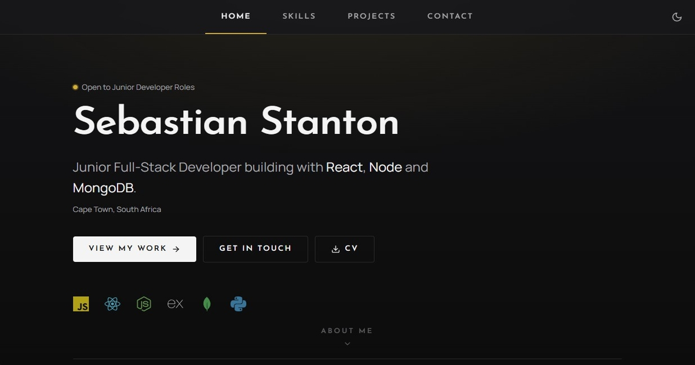

# Portfolio

Personal portfolio for **Sebastian Stanton**, a junior full-stack developer based in Cape Town.
Built with React, TypeScript, Tailwind CSS and a Vercel serverless function.

**Live at [szstanton.com](https://szstanton.com)**



---

## About

A multi-page portfolio built from scratch rather than from a template. The visual direction is
restrained art deco: a neutral palette, gold used only as an accent, and a geometric display face
paired with a readable body face.

It is also the project I am using to learn TypeScript and Tailwind, so a fair amount of the code
exists to work those out in the open rather than because a portfolio strictly needs it.

## Features

- **Four pages** with client-side routing, a 404, and a previous/next pager
- **Light and dark themes**, remembered between visits and applied before first paint so there is no flash
- **Contact form** with shared validation rules, a honeypot, rate limiting and sender domain checks
- **Route-based code splitting**, so the contact form's validation libraries never load on the home page
- **Four ways to change page**: the nav, the pager, arrow keys, and arrows that appear near the screen edges
- **Certificates** in the experience timeline, opening full size in a lightbox
- **Accessibility**: skip link, keyboard navigation, focus rings, `aria-live` form status, reduced-motion support

## Built with

|               |                                                                 |
| ------------- | --------------------------------------------------------------- |
| **Framework** | React 19, TypeScript 6, Vite 8                                  |
| **Routing**   | React Router 8                                                  |
| **Styling**   | Tailwind CSS 4, CSS-first config                                |
| **Animation** | Motion, loaded lazily                                           |
| **Forms**     | React Hook Form + Zod                                           |
| **Icons**     | react-icons: Lucide for interface, Simple Icons for brand logos |
| **Fonts**     | Josefin Sans and Manrope, self-hosted variable fonts            |
| **Backend**   | Vercel serverless function, Resend for delivery                 |
| **CI**        | GitHub Actions, lint and build on every push and pull request   |

## Running it locally

```bash
git clone https://github.com/SZStanton/portfolio.git
cd portfolio
npm install
npm run dev
```

The contact form needs two environment variables. Copy the example file and fill them in:

```bash
cp .env.example .env.local
```

| Variable           | What it is                                    |
| ------------------ | --------------------------------------------- |
| `RESEND_API_KEY`   | API key from [resend.com](https://resend.com) |
| `CONTACT_TO_EMAIL` | Where form submissions are delivered          |

Note that `npm run dev` runs Vite only, so `/api/contact` will not exist. Testing the form locally
needs `vercel dev`.

### Scripts

| Command           | Does                                  |
| ----------------- | ------------------------------------- |
| `npm run dev`     | Start the dev server                  |
| `npm run build`   | Type-check, then build for production |
| `npm run preview` | Serve the production build locally    |
| `npm run lint`    | Run ESLint                            |

## Structure

```
src/
├── assets/          Certificates, photo, CV. Imported, so they get hashed
├── components/
│   ├── layout/      Navbar, Footer, PageNav, Layout
│   ├── sections/    Hero, About, ProjectCard
│   └── ui/          Button, TechIcon, Lightbox, and friends
├── pages/           One file per route
├── data/            Projects, skills, navigation, tech colours
├── hooks/           Theme, arrow-key navigation
├── lib/             Zod schemas
└── types/           Shared types
api/
└── contact.ts       Serverless function, form to inbox
```

## Contact

Via the [contact form](https://szstanton.com/contact), or on
[LinkedIn](https://www.linkedin.com/in/sebastian-stanton-5464b0139).
